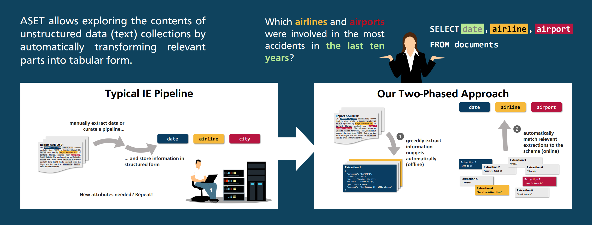

# ASET: Ad-hoc Structured Exploration of Text Collections

ASET extracts information nuggets from a collection of textual documents and matches them to a list of user-specified
attributes.

Run `main.py` to start the ASET GUI.

## Data Sets

The evaluation scripts use multiple data sets to evaluate the system.

* The **aviation data set** consists of executive summaries from the NTSB Aviation Accident Reports.
* The **corona data set** consists of summaries of the RKI's daily reports about the Covid-19 situation in Germany.
* The **countries data set** consists of articles about sovereign states from the T-REx dataset
* The **nobel data set** consists of articles about nobel price winners from the T-REx dataset
* The **skyscrapers data aset** consists of articles about skyscrapers from the T-REx dataset

T-Rex dataset: [https://hadyelsahar.github.io/t-rex/](https://hadyelsahar.github.io/t-rex/)

For each data set, there is a `handler` module that is meant to access the data set. The annotated documents of the data
set are stored as `*.json` files in the `documents` folder. The raw documents are stored as `*.txt` files in
the `raw-documents` folder.

## Set up the Project

This project runs with Python 3.9.7.

Check out the `requirements.txt` file to see which packages have to be installed.

You can install them with `pip install -r requirements.txt`.

You may have to install `torch` by hand if you want to use CUDA:

https://pytorch.org/get-started/locally/

Make sure to also install `pytest` to execute the tests.
