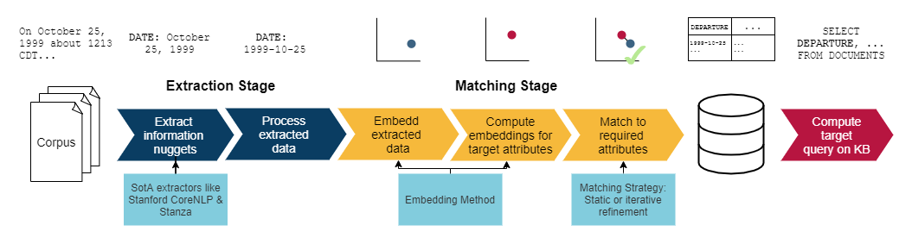

# ASET: Ad-hoc Structured Exploration of Text Collections

This is the home of the **ASET**.

ASET extracts information nuggets (extractions) from a collection of documents and matches them to a list of user-specified attributes. Each document corresponds with a single row in the resulting table.

Follow the steps below to prepare the project.

Copy your documents into `input` as `*.txt` files and run `run.py` to start the program. The output will be saved in the `output` directory as a `*.csv` file.

## Repository Structure
* `aset` ASET implementation
* `datasets` evaluation data sets
* `input` documents to be processed
* `output` resulting output
* `results` evaluation results
* `paper_experiments` code to re-run the experiments from the paper

## Data Sets
The evaluation scripts use multiple data sets to evaluate the system.

* The **aviation data set** consists of the executive summaries from the NTSB Aviation Accident Reports.
* The **corona data set** consists of summaries of the RKI's daily reports about the Covid-19 situation in Germany.

For each data set, there is a `handler` module that is meant to access the data set. The annotated documents of the data set are stored as `*.json` files in the `documents` folder. The raw documents are stored as `*.txt` files in the `raw-documents` folder.

_We will provide scripts to compile our data sets from the original files that can be obtained from the web pages of NTSB and RKI in the next days._

Furthermore, there is a `match_by_hand` script that allows you to perform the matching process by hand.

Check out the documentation inside the scripts for more information.

## Set up the Project
Check out the `requirements.txt` file to see which packages have to be installed.

You can install them with `pip install -r requirements.txt`.

You may have to install `torch` by hand if you want to use CUDA:

https://pytorch.org/get-started/locally/

### Stanza
To prepare Stanza, you must execute `import stanza`, followed by `stanza.download('en')` to download the necessary resources.

### Stanford CoreNLP through Stanza
To use Stanford CoreNLP through Stanza, you must execute `import stanza`, followed by `stanza.install_corenlp()` to set up the Stanford CoreNLP client.

In case this automatic method does not work, follow the guide for "Accessing Java Stanford CoreNLP software" from this link:

https://stanfordnlp.github.io/stanza/corenlp_client.html

### FastText
Download `FastText` from this link:

https://fasttext.cc/docs/en/english-vectors.html

Unpack the zip archive and copy the vectors file `wiki-news-300d-1M-subword.vec` into the root folder of the project.

### GloVe
Download `GloVe` from this link:

https://nlp.stanford.edu/projects/glove/

Unpack the zip archive and copy the vectors file `glove.6B.300d.txt` into the root folder of the project.

